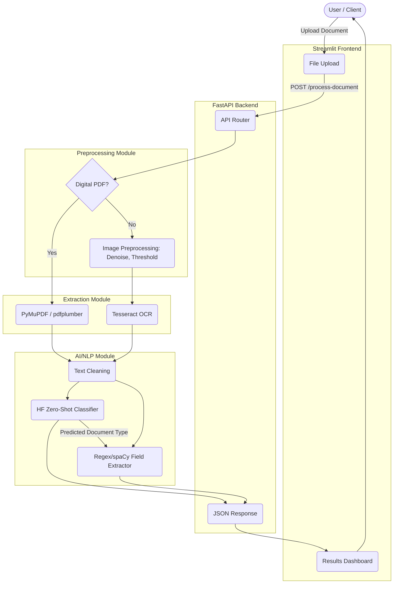

# System Architecture

The following diagram illustrates the data flow and component interactions within the Document Classification & Extraction pipeline.

```mermaid
flowchart TD
    User([User / Client])
    
    subgraph UI [Streamlit Frontend]
        Upload(File Upload)
        Dashboard(Results Dashboard)
    end
    
    subgraph API [FastAPI Backend]
        Router(API Router)
        Response(JSON Response)
    end
    
    subgraph Preprocessing [Preprocessing Module]
        Detector{Digital PDF?}
        ImgPreproc(Image Preprocessing: Denoise, Threshold)
    end
    
    subgraph Extraction [Extraction Module]
        PDFExt(PyMuPDF / pdfplumber)
        OCR(Tesseract OCR)
    end
    
    subgraph AI [AI/NLP Module]
        Cleaner(Text Cleaning)
        Classifier(HF Zero-Shot Classifier)
        FieldExt(Regex/spaCy Field Extractor)
    end

    %% Flow
    User -->|Upload Document| Upload
    Upload -->|POST /process-document| Router
    Router --> Detector
    
    Detector -->|Yes| PDFExt
    Detector -->|No| ImgPreproc
    ImgPreproc --> OCR
    
    PDFExt --> Cleaner
    OCR --> Cleaner
    
    Cleaner --> Classifier
    Classifier -->|Predicted Document Type| FieldExt
    Cleaner --> FieldExt
    
    Classifier --> Response
    FieldExt --> Response
    Response --> Dashboard
    Dashboard --> User
```
